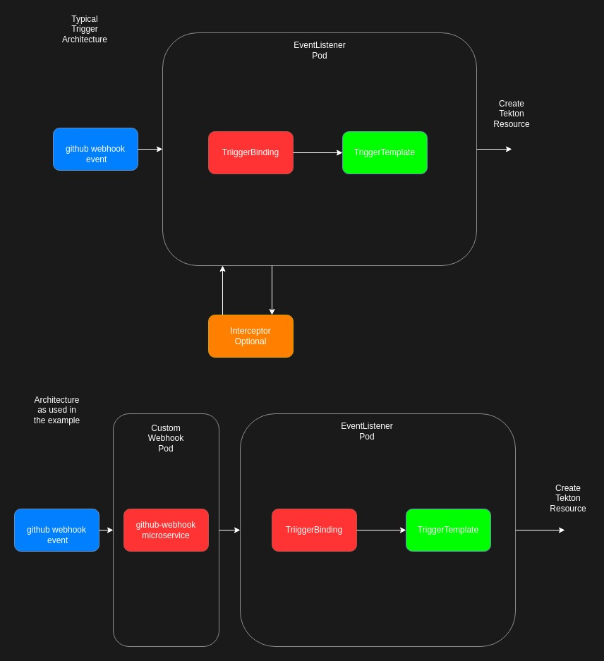

# Tekton Trigger Example

## Intro

All the necessary yaml files to deploy a generic tekton eventlistener, triggerbindings and triggertemplates, with an example pipeline

## Description

This is simple example that uses an eventlistener to trigger a pipeline.

The flow works as follows :

```bash
github-webhook (json post) -> openshift-route -> github-webhook-microservice -> eventlistener (pod) -> triggerbinding -> triggertemplate


```

The diagram below shows the architecture of a typical trigger and the one used in the example



## Installation

### Install Tekton Operator

Install the tekton cli and tekton resources before continuing (see https://tekton.dev/docs/pipelines/install)

Install tekton triggers (see https://tekton.dev/docs/installation/triggers/)

### Clone the repository

```bash
git clone git@github.com:okd-project/okd-tekton-trigger-example
```

### Install the trigger example and pipeline with kustomize

Execute the following commands 

**N.B** - change the variables in the patch-envars.yaml file before commencing (as in the comments below)

```bash
cd okd-tekton-trigger-example
# create the okd-team namespace (if not already created)
kubectl create ns okd-team

# assume you are logged into your kubernetes cluster
# change the values of the default variables in
# environments/overlays/cicd/patches/patch-envars.yaml
# BASE_REGISTRY -> quay.io/okd and TAG_VERSION -> v0.0.1 (as an example) 
kubectl apply -k environments/overlays/cicd

# check that all resources have deployed
kubectl get all -n okd-team
kubectl get pvc -n okd-team

# once all pods are in the RUNNING status create a configmap as follows
# this assumes you have the correct credentials and have logged into the registry to push images to
kubectl create configmap docker-config --from-file=/$HOME/.docker/config.json -n okd-team
```

## Github Webhook Setup


Navigate (webconsole) to the repository that you would like to use the trigger for

Go to Settings -> Webhooks and add Webhook

In the example the route that was created (operate-first.cloud) is 
```	
https://trigger-service-okd-team.apps.smaug.na.operate-first.cloud
```

Add the endpoint to the route url 
```
https://trigger-service-okd-team.apps.smaug.na.operate-first.cloud/api/v1/service
```

Leave the secret blank and save


## Microservice Setup

In the microservice I have created 4 various envars to intercept specific events.
If left empty the trigger will not be enabled. 

```bash
PR_OPENED_URL
PR_MERGED_URL
PRERELEASED_URL
RELEASED_URL
```

The example has the PR_MERGED_URL enabled i.e.

```http://el-okd-trigger-example.okd-team.svc.cluster.local:8080``` 

and so the pipeline will only be started on a merged PR

The gitweb-hook repo is [here](https://github.com/luigizuccarelli/golang-gitwebhook-service),
please fork and change as you please. Also PR's are welcome
